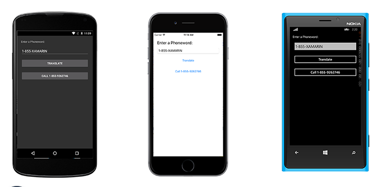
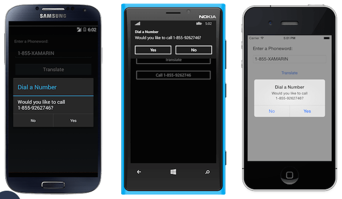

# Phoneword

Xamarin.Forms application which displays a UI to translate an alphanumeric phone number to a numeric number and place a call. The UI will consist of a: Label, an Entry, and two Button controls.

